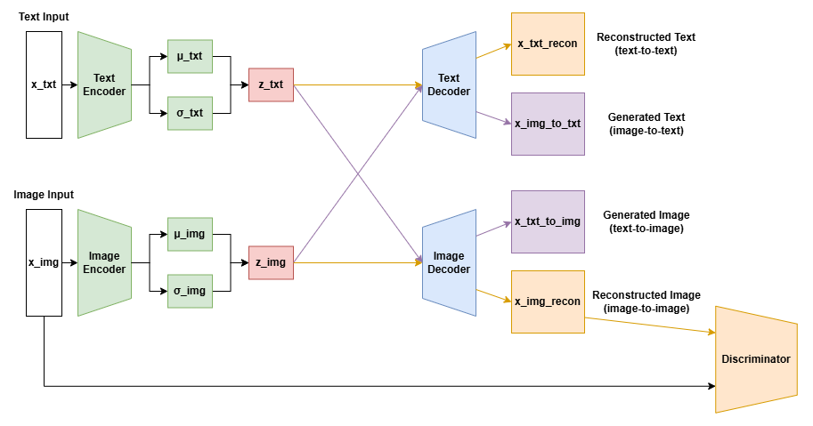

# Multimodal VAE for Text-Image Tasks

This repository contains the implementation of the multimodal VAAE architecture described in my paper Exploring Effectiveness of Multimodal Variational Autoencoders on Text-Image Tasks. 

## Overview

The model consists of two VAEs (Text VAE and Image VAE) with a shared latent space, enabling the following tasks:
- Consistency checking between text-image pairs
- Text-to-image generation
- Image-to-text generation

### Model Architecture


## Results

### Consistency Checking Results

#### Consistency checking examples


#### Confusion Matrix (Latent Dimension = 256)
|                     | Predicted Mismatch | Predicted Match |
|---------------------|--------------------|-----------------|
| **Actual Mismatch** | 427                | 73              |
| **Actual Match**    | 40                 | 460             |

#### Performance Metrics for Different Latent Dimensions
| Latent Dim | Accuracy | Precision | Recall | F1 Score |
|------------|----------|-----------|--------|----------|
| **128**    | 0.92     | 0.90      | 0.94   | 0.92     |
| **256**    | 0.89     | 0.86      | 0.92   | 0.89     |
| **512**    | 0.88     | 0.86      | 0.91   | 0.88     |

### Latent Space Visualization
t-SNE visualization of image and text embeddings in the shared latent space, showing clear gender-based clustering and alignment between modalities.


### Cross-Modal Generation Examples
#### Text-to-image generation


#### Image-to-text generation


## Dataset

We use the CelebAMask-HQ dataset (Lee et al., 2020) with the following specifications:
- 5,000 examples (split 90/10 for training/validation) selected from the full 30,000 example dataset
- Images resized to 64x64 resolution (from original 512x512)
- 10 binary attributes (young, male, female, smiling, eyeglasses, black hair, blond hair, bald, mustache, wearing lipstick)


The CelebAMask-HQ dataset is available for non-commercial research purposes only. For more details, visit the [CelebAMask-HQ project page](https://mmlab.ie.cuhk.edu.hk/projects/CelebA/CelebAMask_HQ.html).

## Model Architecture

### Text VAE
- Fully connected layers for encoder and decoder
- Binary attribute vector input
- Sigmoid activation for attribute probability output

### Image VAE
- Convolutional encoder and decoder networks
- Patch discriminator for image quality improvement
- ResidualBlocks and ResidualLinear components
- VGG16 for perceptual loss computation

## Training

The model uses a three-phase training strategy:

1. **Phase 1: Unimodal Training**
   - Focus on unimodal reconstruction
   - 40 epochs

2. **Phase 2: Cross-Modal Alignment**
   - Introduces consistency and distribution matching
   - 30 epochs

3. **Phase 3: Adversarial Refinement**
   - Adds adversarial training for image quality
   - 70 epochs

### Hyperparameters
- Latent dimensions: 256 (also tested with 128 and 512)
- Batch size: 16
- Learning rate: 1e-4 (generator), 1e-5 (discriminator)
- Random seed: 42
- Optimizer: AdamW
  - betas: (0.5, 0.999)
  - weight_decay: 0.02

## Citation

If you use this code in your research, please cite:

```bibtex
@article{kim2024exploring,
   title={Exploring Effectiveness of Multimodal Variational Autoencoders on Text-Image Tasks},
   author={Kim, Joseph Taewoo},
   journal={Stanford University},
   year={2024}
}
```

For the CelebAMask-HQ dataset, please cite:
```bibtex
@inproceedings{CelebAMask-HQ,
   title={MaskGAN: Towards Diverse and Interactive Facial Image Manipulation},
   author={Lee, Cheng-Han and Liu, Ziwei and Wu, Lingyun and Luo, Ping},
   booktitle={IEEE Conference on Computer Vision and Pattern Recognition (CVPR)},
   year={2020}
}
```
